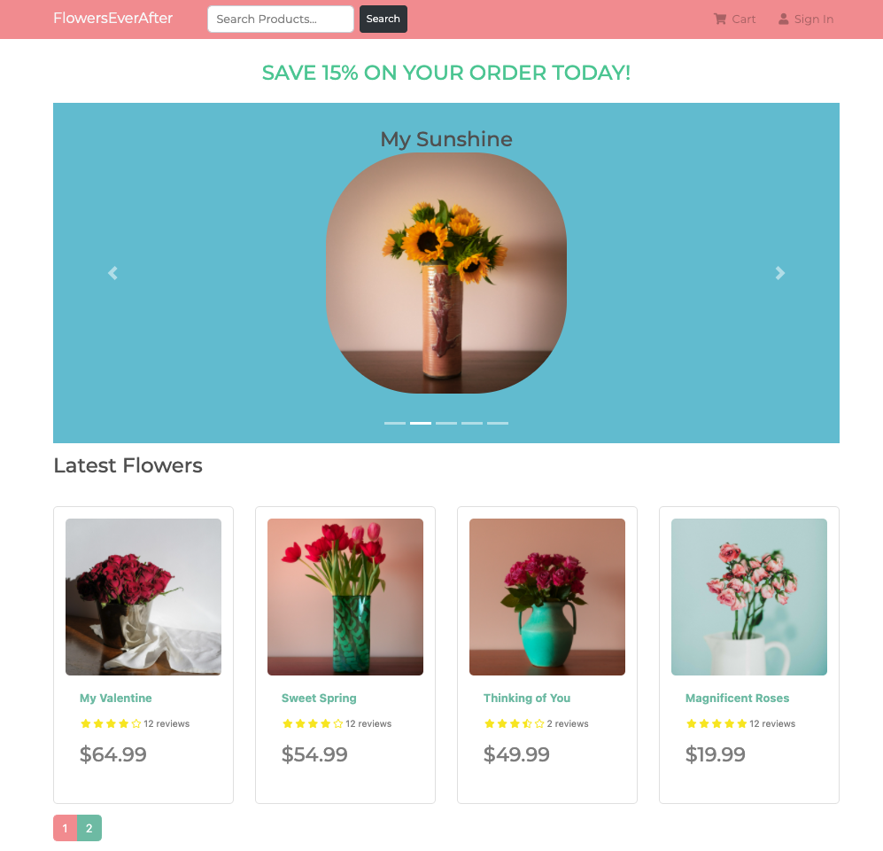

# FlowersEverAfter
E-commerce floral shop allowing customers to to shop, rate, and review floral bouquet products.
## Features
- Integrated Paypal SDK and customized middleware to provide both users and proprietors fast and secure payment options.

- Engineered a RESTful API backend deployed on Heroku with endpoints for products, users and orders.

- Built an Admin platform and leveraged the Redux library to provide proprietors with a customized dashboard of customer sales data.

## Demo COMING SOON
<p align="center">
  
</p>
<hr/>

## Technology Used 
- React
- Redux
- Node.js
- Express
- MongoDB


## Getting Started
1. Fork and clone from this repository onto your local machine.
```bash
$ git clone https://github.com/devJimmyLam/FlowersEverAfter.git
```
2. Install the required dependencies:
cd to root of app and run command below 
```
$ npm install
```
cd to frontend and run command below
```
$ npm install
```
3. Run your server
cd to root and command below will run both frontend (:3000) & backend (:5000)
```
npm run dev
```

## Built With
* Front-End
  * [React](https://reactjs.org/)
  * [Redux.js](https://redux.js.org/)
  * [react-bootstrap](https://react-bootstrap.github.io/)
* Back-End
  * [Node.js](https://www.oracle.com/java/technologies/)
  * [Express](https://expressjs.com/)
  * [MongoDB](https://www.mongodb.com/)

## Contributing
Please feel free to fork from this repository, make pull requests and help improve the web app by sending suggestions to dev.jimmylam@gmail.com
